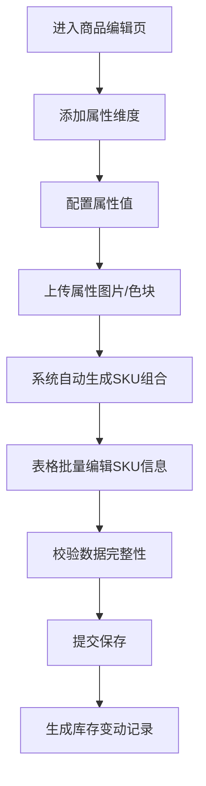
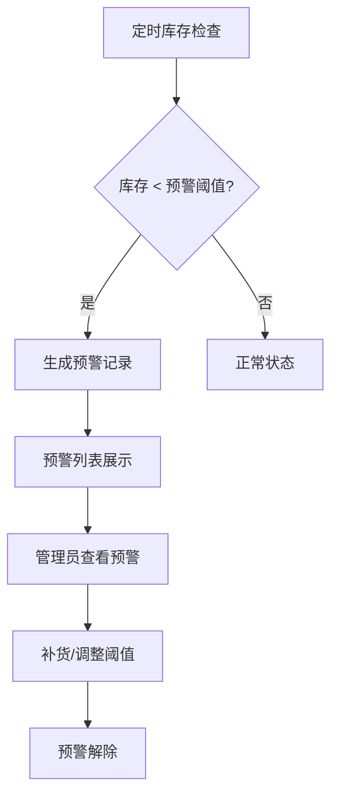

## 1. 产品概述

电商商品SKU管理系统，为电商运营人员提供高效的商品SKU全生命周期管理工具。系统支持多属性维度配置、自动生成SKU组合、批量编辑、库存预警等核心功能，帮助商家快速上架商品、精准管控库存。

- 目标用户：电商运营人员、商品管理员、库存管理人员
- 核心价值：提升SKU配置效率、降低库存管理成本、减少库存滞销与缺货风险

## 2. 核心功能

### 2.1 用户角色

| 角色 | 登录方式 | 核心权限 |
|------|----------|----------|
| 商品管理员 | 账号登录 | 商品管理、属性配置、SKU编辑、库存查询、数据导出 |
| 库存管理员 | 账号登录 | 库存查询、库存流水、预警管理、数据导出 |

### 2.2 功能模块

1. **商品管理首页**：商品列表、搜索筛选、库存预警概览
2. **商品SKU编辑页**：属性维度配置、SKU表格编辑、批量保存
3. **属性值配置**：属性值图片上传、颜色色块配置
4. **库存流水查询页**：库存变动记录、多维度筛选查询
5. **库存预警页**：预警列表、阈值设置、预警处理
6. **前台商品展示页**：属性可视化选择、SKU价格库存展示

### 2.3 页面详情

| 页面名称 | 模块名称 | 功能描述 |
|----------|----------|----------|
| 商品管理首页 | 商品列表 | 商品卡片展示、搜索、分类筛选、状态标签 |
| 商品管理首页 | 预警概览 | 预警数量统计、快速跳转预警列表 |
| 商品SKU编辑页 | 属性维度配置 | 添加/删除属性维度、配置属性值、属性值图片上传 |
| 商品SKU编辑页 | SKU表格 | 笛卡尔积自动生成、行内编辑、批量修改、全选操作 |
| 商品SKU编辑页 | 批量操作 | 批量设置价格、批量调整库存、一键导出 |
| 库存流水查询页 | 流水列表 | 变动时间、变动类型、变动数量、操作人、备注 |
| 库存流水查询页 | 筛选查询 | 按商品、时间范围、变动类型筛选 |
| 库存预警页 | 预警列表 | 预警SKU列表、预警等级、当前库存、阈值 |
| 库存预警页 | 阈值设置 | 全局预警阈值、单商品阈值配置 |
| 前台商品展示页 | 属性选择 | 可视化属性选择、颜色色块、图片展示 |
| 前台商品展示页 | SKU信息 | 价格、库存、商品编码实时展示 |

## 3. 核心流程

### 3.1 SKU配置流程

商品管理员进入商品SKU编辑页，添加属性维度（如颜色、尺码），为每个维度配置属性值（颜色可配置色块图片），系统自动计算笛卡尔积生成所有SKU组合，管理员在表格中批量编辑每个SKU的价格、成本、库存和编码，确认后一次性提交保存。

### 3.2 库存预警流程

系统定时检查所有SKU库存，当库存低于预设阈值时触发预警，在管理后台预警列表中展示，管理员可查看详情并进行补货处理。

## 4. 用户界面设计

### 4.1 设计风格

- **主色调**：深邃商务蓝 (#1e40af)，体现专业与可信赖感
- **辅助色**：橙红色预警 (#ef4444)、绿色成功 (#10b981)、金色提醒 (#f59e0b)
- **按钮风格**：圆角6px，渐变背景，悬停微动效
- **字体**：标题使用 "Noto Sans SC" 加粗，正文使用 "Inter" 常规
- **布局风格**：左侧导航 + 顶部操作栏 + 主体内容区，卡片式布局
- **图标风格**：线性简洁图标，统一2px描边

### 4.2 页面设计概览

| 页面名称 | 模块名称 | UI元素 |
|----------|----------|--------|
| 商品管理首页 | 商品列表 | 卡片网格、悬停上浮效果、状态角标、渐变背景 |
| 商品SKU编辑页 | 属性配置 | 标签式属性维度切换、属性值拖拽排序、图片上传预览 |
| 商品SKU编辑页 | SKU表格 | 斑马纹行、行内编辑、固定表头、批量操作工具栏 |
| 库存流水查询页 | 流水列表 | 时间轴样式、变动类型色块、数量正负颜色区分 |
| 库存预警页 | 预警列表 | 预警等级颜色标识、库存进度条、快速补货按钮 |
| 前台商品展示页 | 属性选择 | 颜色色块圆形按钮、尺码胶囊按钮、选中态动画 |

### 4.3 响应式

- 桌面端优先设计（1280px起）
- 平板端：侧边栏折叠、表格横向滚动
- 移动端：卡片式布局、底部导航

### 4.4 交互动效

- 页面切换：淡入 + 轻微上移动画
- 表格行：悬停背景色变化、选中行高亮
- 属性值选择：平滑缩放 + 边框高亮
- 预警提示：脉冲动画吸引注意
- 按钮点击：缩放反馈 + 涟漪效果
