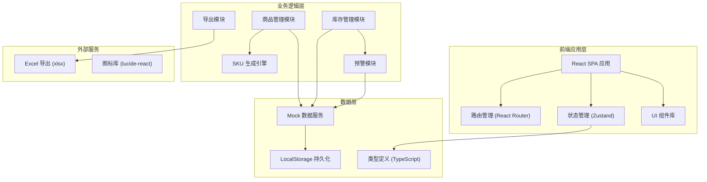
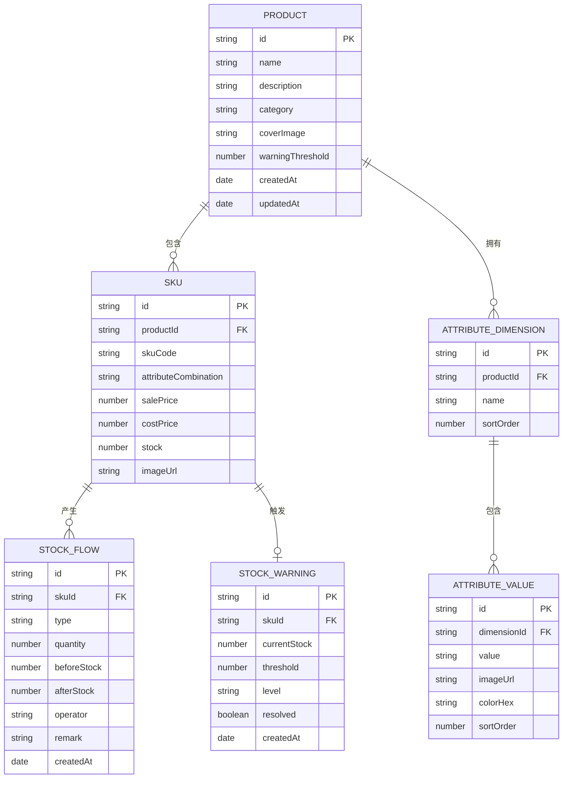

## 1. 架构设计



## 2. 技术描述

- **前端框架**：React 18 + TypeScript 5
- **构建工具**：Vite 5
- **样式方案**：TailwindCSS 3 + CSS Variables
- **路由管理**：React Router v6
- **状态管理**：Zustand (轻量级状态管理)
- **UI 组件**：自定义组件 + lucide-react 图标
- **Excel 导出**：xlsx (SheetJS)
- **数据持久化**：LocalStorage + Mock 数据
- **代码规范**：ESLint + Prettier

## 3. 路由定义

| 路由路径 | 页面名称 | 功能描述 |
|----------|----------|----------|
| / | 商品列表页 | 商品概览、搜索筛选、预警统计 |
| /product/:id | 商品SKU编辑页 | 属性配置、SKU表格编辑、批量保存 |
| /inventory/flow | 库存流水页 | 库存变动记录、筛选查询 |
| /inventory/warning | 库存预警页 | 预警列表、阈值配置 |
| /product/preview | 前台商品预览 | 属性可视化选择、SKU展示 |

## 4. 数据模型

### 4.1 数据模型定义



### 4.2 类型定义

```typescript
// 商品
interface Product {
  id: string;
  name: string;
  description: string;
  category: string;
  coverImage: string;
  warningThreshold: number;
  createdAt: string;
  updatedAt: string;
}

// 属性维度
interface AttributeDimension {
  id: string;
  productId: string;
  name: string;
  sortOrder: number;
  values: AttributeValue[];
}

// 属性值
interface AttributeValue {
  id: string;
  dimensionId: string;
  value: string;
  imageUrl?: string;
  colorHex?: string;
  sortOrder: number;
}

// SKU
interface Sku {
  id: string;
  productId: string;
  skuCode: string;
  attributes: Record<string, string>;
  attributeLabels: Record<string, string>;
  salePrice: number;
  costPrice: number;
  stock: number;
  imageUrl?: string;
}

// 库存流水
interface StockFlow {
  id: string;
  skuId: string;
  skuCode: string;
  productName: string;
  type: 'in' | 'out' | 'adjust';
  quantity: number;
  beforeStock: number;
  afterStock: number;
  operator: string;
  remark: string;
  createdAt: string;
}

// 库存预警
interface StockWarning {
  id: string;
  skuId: string;
  skuCode: string;
  productName: string;
  attributes: Record<string, string>;
  currentStock: number;
  threshold: number;
  level: 'low' | 'medium' | 'high';
  resolved: boolean;
  createdAt: string;
}
```

## 5. 目录结构

```
src/
├── components/          # 通用组件
│   ├── Layout/         # 布局组件
│   ├── Table/          # 表格组件
│   ├── Modal/          # 弹窗组件
│   └── Form/           # 表单组件
├── pages/              # 页面组件
│   ├── ProductList/    # 商品列表页
│   ├── ProductEdit/    # 商品SKU编辑页
│   ├── StockFlow/      # 库存流水页
│   ├── StockWarning/   # 库存预警页
│   └── ProductPreview/ # 前台商品预览页
├── store/              # 状态管理
│   ├── productStore.ts
│   └── stockStore.ts
├── types/              # 类型定义
│   └── index.ts
├── utils/              # 工具函数
│   ├── skuGenerator.ts # SKU笛卡尔积生成
│   ├── excelExport.ts  # Excel导出
│   └── mockData.ts     # Mock数据
├── hooks/              # 自定义Hooks
│   └── useSku.ts
├── App.tsx
├── main.tsx
└── index.css
```

## 6. 核心算法

### 6.1 笛卡尔积SKU生成算法

```typescript
function generateSkuCombinations(dimensions: AttributeDimension[]): Sku[] {
  // 递归生成所有属性组合
  // 为每个组合生成唯一SKU
  // 初始化默认价格、成本、库存
}
```

### 6.2 库存预警等级计算

```typescript
function getWarningLevel(stock: number, threshold: number): 'low' | 'medium' | 'high' {
  const ratio = stock / threshold;
  if (ratio <= 0.3) return 'high';      // 高危
  if (ratio <= 0.6) return 'medium';    // 中危
  return 'low';                          // 低危
}
```
